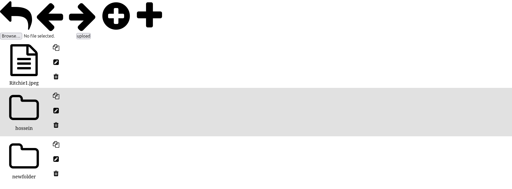

# FileManager

A simple file manager for navigating directories, allowing users to create, rename, delete, or copy files and directories, upload files, and download files.



## Features

- **Navigate Directories**: Easily browse through directories and subdirectories.
- **File Operations**: Create, rename, delete, or copy files and directories.
- **File Upload**: Upload files to the desired directory.
- **File Download**: Download files directly from the file manager.
- **Simple Interface**: Lightweight and user-friendly design for efficient file management.

## Installation

You can set up the FileManager using either **XAMPP** or **PHP's built-in server**. Follow the steps below for your preferred method.

## Option 1: Using XAMPP :)

git clone https://github.com/a-sabagh/FileManager.git

### Option 2: Using PHP's Built-in Server

1. **Ensure PHP is Installed**:
   
   - Verify that PHP is installed on your system by running php -v in your terminal. If not installed, download and install PHP from [https://www.php.net/](https://www.php.net/).

2. **Clone the Repository**:

```bash
git clone https://github.com/a-sabagh/FileManager.git
```

3. Navigate to the Project Directory:

```bash
cd FileManager
```

4. Start PHP's Built-in Server:

```bash
php -S localhost:8000
```

**Access the FileManager**:

- Open your browser and go to http://localhost:8000/index.php.
- The FileManager interface should now be accessible.
